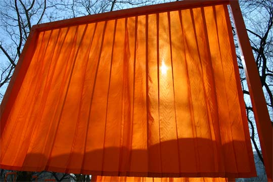
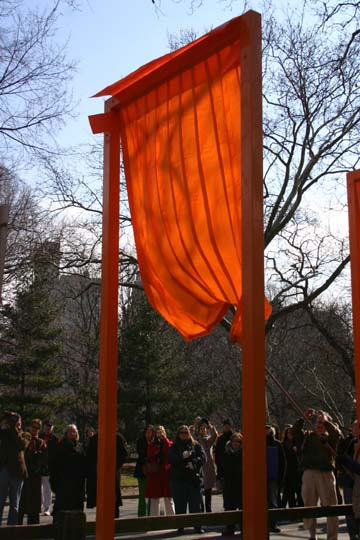
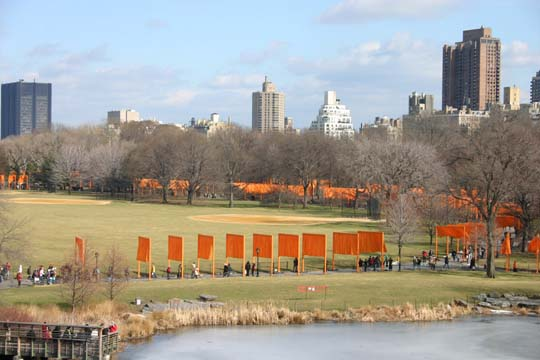

New York is the best city in the world, and I don’t mean just to visit. If you don’t already know this, then I’m not going to try to explain it to you. The importance of Central Park to this wonderful equation can hardly be overstated. We sometimes refer to the park as the “lungs” of the city, but it’s really more than that. It’s the whole thorax of the city, its heart and soul and maybe even its brain too. To mess with the park on such a grand scale as that perpetrated by Chrisco takes some, uhm, chutzpah. But fear not, because it takes more than $20 million worth of polyester to wreck this place. In fact, that’s one of the first things you realize when you see this art work, that the scale is somehow all wrong. Chrisco can wrap the Pont Neuf in fabric and change it in its entirety. But here, he’s not wrapping up the park, he’s just dabbing it here and there with some splotches of color. It’s like an over-ambitious painter buying a giant canvas and then realizing he doesn't have nearly enough paint to fill it. I’ve heard the orange described a few ways, but to my cynical mind, it recalls the color of Gitmo jumpsuits...

For some reason, many hundreds of people thought that capturing the act of unfurling a gate would make for a great picture. But it really didn’t:

Before seeing the gates, you try picture in your mind’s eye the massive scale of the thing. But it’s very difficult to find a good vantage point. Here, we’re looking down from Belvedere castle, the highest point in the Park. It still disappoints me. I've seen a satellite photograph, and it also left me unmoved.

So, am I being too critical, or did this thing really just suck?
