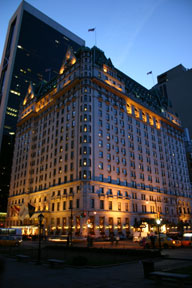

So we were sitting in the Oak Bar, having cocktails with friends who had traveled from Toronto to see the Gates, when B. said, “it’s a shame about the Plaza closing, isn’t it?” “The Plaza closing?” I replied with my trademark incredulity, “no, you’re probably thinking of the Gramercy Hotel, which just closed to go condo.” I think it was the next day when I saw an ad from the union protesting the hotel’s closing—and then it sank in. $400 a night for a room and a grand for a jr. suite just isn’t enough to make money in NYC anymore. Not when you can carve the place up into $50M condos...

One of the prettiest small parks in New York is Gramercy Park. What was interesting to me when I first saw it is that it’s not open to the public. In fact, is has a tall wrought iron fence around it and big locked gates. It’s a private park, and one of the privileges of living in this square (hi Julia!) is getting the keys to the park. Coming from Canada, this notion of a locked park struck me as a bit odd, a bit in the same way that bringing a credit card to the doctor’s office did. But New York has always been comfortable with this interplay of public and private. The Villard Houses were originally built as private homes, now they are the New York Palace hotel. But the current real estate boom is driving everything in the private direction. Earlier this year, the Gramercy Hotel ceased operations, sold off its furniture and now is converting to condos. This had been sort of a shabby-chic version of the Plaza, a place for rock stars to smash furniture when they couldn’t get into the Chelsea. And another fine hotel-bar watering hole.

Spending a weekend at the Plaza has always been on my to-do list, but low on the priority level because I live just down the street, and because, well it’s the Plaza, it’s not going anywhere! A few years back, a similar to-do was dining at the Rainbow Room, which also closed its doors before I could enjoy it. I think this means I have to re-evaluate some other entries on that list: seeing Bobby Short at the Carlyle, Les Paul at Iridium on Monday nights and maybe even Woody doing his thing. Not that these guys are about to be privatized...

Here’s what’s on the Hotel’s web site at present:

>_The owners of The Plaza have announced that on April 30, 2005, the hotel will close for extensive redevelopment into a mixed use retail, residential and hotel complex, at which point Fairmont Hotels & Resorts will no longer manage The Plaza. \[...\]_
>
_The crown jewel of Manhattan’s fabled Fifth Avenue, The Plaza reigns over New York with a grace and glamour that has drawn visitors from around the globe throughout the century. From glorious meeting rooms and palatial ballrooms to the brilliance of the legendary restaurants, The Plaza dwells in a class by itself. Whether for business or pure pleasure, a stay at The Plaza entails the ultimate in gracious luxury, attentive personal service and the pleasures of an incomparable location at the foot of Central Park._

There’s more in a section on the Hotel’s history:

>_The Plaza opened its doors on October 1, 1907, amid a flurry of impressive reports describing it as the greatest hotel in the world. Located at Fifth Avenue and Central Park South, it was constructed in the most fashionable residential section of New York. \[...\]_
>
*Construction of the 19-story building (a skyscraper back then) took two years at a cost of $12 million - an unprecedented sum in those days. Henry Janeway Hardenbergh, who also designed the Dakota apartments, the Willard Hotel in Washington, D.C. and The Fairmont Copley Plaza Boston, set about his task to provide all the pomp, glory, and opulence of a French chateau. No cost was spared. The largest single order in history for gold-encrusted china was placed with L. Straus & Sons, and no less than 1,650 crystal chandeliers were purchased. \[...\]*
>
_Although The Plaza appeared fleetingly in earlier films, the hotel made its true movie debut in Alfred Hitchcock’s 1959 classic North by Northwest - the first time a crew, director and cast assembled on site to make a picture. Before then, movies were shot almost entirely on Hollywood soundstages and rarely on location. The Plaza has provided the location for other motion pictures such as Plaza Suite, The Way We Were, The Great Gatsby, Barefoot in the Park, Funny Girl, Cotton Club, Crocodile Dundee I and II and Home Alone II: Lost In New-York._

For the love of God, let’s hope they keep the Oak Bar open.

