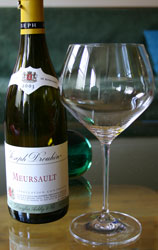

 "I never knew the old Vienna before the war, with its Strauss music, its glamour and easy charm." So begins [_The Third Man_](http://www.imdb.com/title/tt0041959/) (ranking high on my [ten great films](http://blog.cyberkrunk.com/article.pl?sid=05/02/22/1458205&mode=flat) list), in which the city itself fills out the ensemble cast. It occurs to me just now that in the course of the film, we travel through this meta-character, enter its mouth, see through its eyes, travel to the brain, to the heart and then finally, and most famously, end up in its guts, after which Harry Lime tries in vain to escape through a small circular opening.

That's all well and good, you say, but what does Wien have to do with Wein? This, mein freund, Austria is the land of not only [fine audio](http://www.akg.com/) ([Germany](http://www.neumann.com/) is no slouch, either), but also [the finest wine glasses on planet Earth](http://www.riedel.com/). Here's the thing, though, not only are these glasses the finest, they are also the best, an important distinction. Wine glasses are functional devices and the great majority of them fail to deliver. People have caught on to the fact that for serving good red wine, you need a glass with a large bowl for swirling, and a concave shape for capturing the bouquet. And yet it's still common to see good whites served in tiny glasses, filled to the brim. Until yesterday, that had been the case at our place as well, but no longer. We've added a set of the [Vinum Extreme](http://www.riedel.com/website/english/frameset/homeenglish/collections/riedel_collections/vinum_extreme/vinum_extreme1/vinum_extreme1.html) Chardonnay glasses to the collection. The first test drive took place last night with the lovely Joseph Drouhin Meursault 2003, pictured left.

First off, like the other glasses in this collection, these are beautiful, and perfectly balanced. The extreme collection has sharper angles than the more traditional glasses. As you can also see in the picture, they are enormous! When I swirl, I mean business--think Pete Townshend--and these glasses are up to the task. The upper part of the bowl perfectly focused the Drouhin's honey and light citrus notes. Drinking out of traditional "white wine glasses" is like trying to drink with your nose plugged, with these, it's like you're wearing a super deluxe [breathe-rite](http://www.breatheright.com/) strip. And that makes all the difference!
