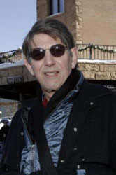

 Hal died Thursday night, his captors not really sure why. Nor is anyone sure where he came from, or how he got to Central Park in the first place. Would it have been possible to let a coyote live in Central Park, roaming around _forever wild_, or _the ramble_? Howling at night? Could he have survived there, among the racoons, rats (aka coyote food), polar bears and tourists? There would have been something right about that. But it wasn't to be, and maybe the thought of that was too much for him. Maybe, after Hal's Manhattan adventure, he just couldn't bear returning to the sticks.

 Meanwhile, in Vancouver, AM and friend sit down in a movie house. They're there to see _V for Vendetta_. Just before the film starts, someone comes up beside them, asking if the seat is free. After the movie, the three of them sit around for a while chatting. The stranger introduces himself, "I'm Peter Coyote." AM had already recognized him. After chatting some more, Coyote invites them out to dinner. They go to a nearby Thai restaurant. They continue chatting. During dinner, Coyote takes a call from Sean Penn. Coyote is in town shooting a picture. As he is a Buddhist, he does not get into the usual sorts of trouble that might tempt other Hollywood types after hours. Before parting, they exchange email addresses. A few days later, Coyote sends AM the recipe for an herbal energy drink he had mentioned during dinner.
