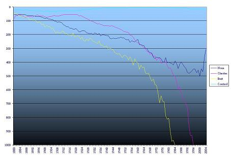

 The graph above (click to embiggen) charts the varying popularity levels of three names chosen at random, since 1880. There's also a popular 4th name thrown in as a control. Care to guess what it is?

You can have more fun [here](http://www.ssa.gov/OACT/babynames/).

And, if you want to be completely freaked out, go [here](http://www.ssa.gov/OACT/babynames/decades/names1970s.html) and look at #388. Spooky!
