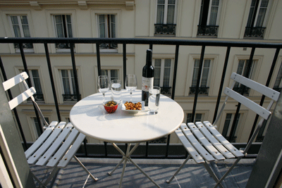

Been on a fine dining jag for the past few weeks that has taken me to such New York gems as [The Firebird](http://www.firebirdrestaurant.com/), [Gotham Bar & Grill](http://www.gothambarandgrill.com/), and most notably, [Aureole](http://www.charliepalmer.com/aureole_ny/home.html) (not to mention [Shun Lee Palace](http://www.shunleepalace.com/newyork/), [Josephina](http://www.josephinanyc.com/samples/josephina/index.html) and ['Cesca](http://cescanyc.com/) -- overrated and overshadowed by our fine company that night, Mr & Ms [S.Fo](http://blog.cyberkrunk.com/article.pl?sid=05/08/12/0714245&mode=flat)). Aureole was, of course, the standout. The scallops with unagi were wonderful, with the sweetness of each playing off the other, contrasted with, I kid you not, slices of cooked pickle in between. The room is befitting the former residence of Orson Welles, one of the main reasons I always wanted to visit this lovely brownstone just a few blocks away from the Hacienda.

Well, we now find ourselves on the other side of the pond, in Paris to be exact. After a long, foodless flight and missing breakfast, we started the day off with a nice pizza from one of my Paris favourites, [Vesuvio](http://www.vesuviocafe.com/). One of their Napoletanas will set you straight. After an afternoon of strolling around both banks, the Hotel delivered a nice little treat, which we enjoyed on our nice little terrace pictured at left. We had the game on in the room, but we could hear by the moans from the Irish pub below that France didn't manage to score against Switzerland, leaving the game tied at zero.

Then it was time for the main event, [L'EPI Dupin](http://www.economist.com/cities/displayobject.cfm?obj_id=1575462). I've been trying, unsuccessfully, to go here for years now. This time, I had the good sense to make a reservation from New York, a few weeks ahead. And when you arrive, you see why you need to reserve. It's a small room and was packed in tightly on a Tuesday night. The place is famous for its great food and gentle prices. It did not disappoint. We both had to have the sardines entree that we had seen others enjoying. Fresh, you might say sushi grade, sardines atop melting mozzarella, tomato and toast. Formidable! I then moved on to tuna with fennel, and Mme. [Celluloid Pantry](http://kitchen.apartmenttherapy.com/food/the-celluloid-pantry/index) had the cod. The tuna was done very differently from the US chain restaurant style (giant slab done with sesame and soy sauce, or whatever passes for an Asian accent). The three pieces, well cooked on the outside, raw on the inside, making the whole a little more flavorful. This was sitting atop large pieces of fennel. Wow. Both courses went nicely with a Latour-Giraud Puligny-Montrachet 2001 Champs Canet. More wow. We skipped a sweet desert and opted instead for some of the house special [St. Nectaire](http://www.fromage-aoc-st-nectaire.com/), a flavorful semi-soft cheese. Capped the evening off at [Le Bar Chinois](http://marriott.com/property/phototour.mi?marshaCode=parvd&pageID=HWRAL&imageID=0) back at the hotel. Mme. had the safir cocktail while M. enjoyed a glass of the 1976 [Labardolive](http://www.labastide-d-armagnac.com/Laberdolive.htm) bas Armangac.
