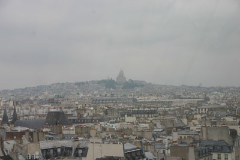
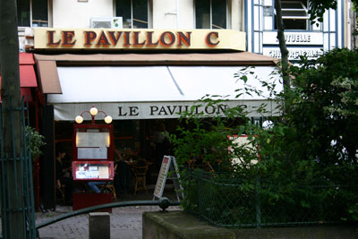

_When art stinks:_

Morning in the [Pompidou](http://www.cnac-gp.fr/Pompidou/Accueil.nsf/tunnel?OpenForm). Where they hiding the good stuff at? Instead of [Kandinsky](http://en.wikipedia.org/wiki/Wassily_Kandinsky), saw things ranging from the irritating to the smelly: "Ketchup Sandwich" which was a stack of sheets of glass with ketchup in between, and "100 boots in their crash pad" which was 100 pairs of rubber boots stashed away in a small room, which the viewer spied through a chained door. [_Concerning the Rancid in Art_](http://www.amazon.com/gp/product/0486234118/103-1646590-1776617?v=glance&n=283155), anyone? [P.U.](http://www.sonicyouth.com/mustang/sy/song90.html)!

Strolling around [rue St. Honore](http://dickens.stanford.edu/archive/tale/issue14_gloss2.html), Beaubourg and Les Halles today. Despite the vow not to have a rich lunch, had some lovely [tartes](/images/articles/tartes.jpg) and white [Burgundy](/images/articles/wine.jpg) on the terrace. Light applause broke out in the little shop over my pronunciation of "[Roquefort](http://roquefort.fr/gb/)". I kid you not.

The overcast days are making my amateur photography difficult, but:

_La Butte, vue de Pompidou:_

_Can Le Pavillon N be far away?_
