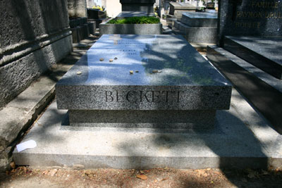
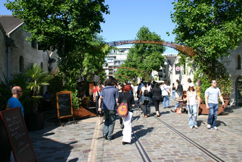

Breakfast included the normal stuff, but also a couple of _fougasses_, something I'd never tried before. Fougasse is like a French version of focaccia, these two were folded over and stuffed, one with chevre and one with tuna and tomato sauce. R&K get theirs from their favourite boulangerie, which makes baguettes (see below, not the magic ones) throughout the day. They put even the Pain Quotidien baguettes to shame. Then we all headed out for a long trek, which began along the Rue de la Gaité, on which sex shops alternate with good Japanese restaurants. The sexy Parisiens don't seem to mind their sex shops at all. Most are in sleazier quartiers, but the Gaité is in the middle of a respectable, if fun, neighborhood. The death march continued appropriately with a diversion in the [Cimetière du Montparnasse](http://en.wikipedia.org/wiki/Cimeti%C3%A8re_du_Montparnasse). We stopped to visit a few of the more famous inhabitants, including [Serge Gainsbourg](http://en.wikipedia.org/wiki/Serge_Gainsbourg), and of course [Samuel Beckett](http://en.wikipedia.org/wiki/Samuel_Beckett). [MW](http://www.resolve40.com/) asked us to bring back two things from our trip, a stone from Paris and a stone from Rome. The Paris stone we decided on was sitting on Beckett's tomb. Hope he likes it.

From there, we continued along the [Boulevard de Montparnasse](http://www.parisbestlodge.com/bvdmontmarnasse.html), passing by familiar joints like [La Coupole](http://www.virtualtourist.com/travel/Europe/France/Ile_de_France/Paris-99080/Restaurants-Paris-La_Coupole-BR-1.html), [La Rotonde](http://www.rotondemontparnasse.com/), and the Montparnasse temple of [Bouillabaisse,](http://www.cliffordawright.com/history/bouillabaisse.html) [Le Dôme](http://www.gayot.com/restaurantpages/parisinfo.php?tag=PARES02242-01&code=PA). La Rotonde is a great place for a Montparnasse nightcap. If you don't want to splurge at Le Dôme, there's [Le Bar à Huîtres](http://www.lebarahuitres.com/) right across the street. There are a few of these in Paris and they're all serviceable and fun. (C'est vrai, SP?)

Continuing through [Les Jardins du Luxembourg](http://www.pbase.com/francist/luxembourg), one of my all-time favourite Paris spots, we gradually wound our way towards le [Bazar de l'Hôtel de Ville](http://www.bhv.fr/), in search of a couple of things: an olive-wood spice grinder and one of these beautiful [Laguiole](http://www.laguiole.com/) cheese knives. Found some, but ended up not buying anything. From there, passed through Le Marais, stopped for a drink, saw some silly baguettes (see below), then, gripping our wallets and bags tightly, got on the metro at Chatelet.

Our destination was [Bercy Village](http://www.bercyvillage.com/), or, more specifically, [Cour St. Emilion](http://www.metropoleparis.com/1998/343/343bercy.html). We had asked R&K to show us more of the Parisen's Paris, and this place fits the bill. It's where the train used to pull up into the wine warehouses. After having been abandoned for some time, the old warehouses now house little shops and bistros. We stopped and enjoyed a nice little [Margaux](http://www.bordeaux-wine-office.com/anglais/aoc51.htm) at Alice Cafe. Not sure why, but this beautiful chanson by [Josquin des Prez](http://www.josquin.com/) was going through my head that afternoon:

> Cueurs desolez par toutes nations, Assembles doeul et lamentation Pour moy de ceste peine dejetter, Car nuyt et jour je ne puis reposer, Mais tousjours suys en tribulation.

R&K are very uneasy about my blogging the fantastic little restaurant where we had a late dinner: [Giufelli](http://www.giufeli.com/). This place is the real thing, and the three-course prix fix is 22 Euros! Little wonder that we all slept until noon the next day.
