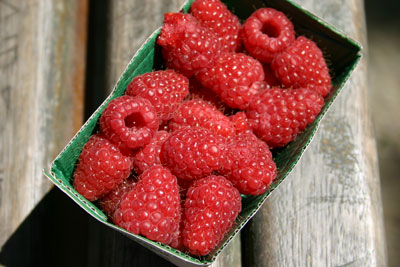
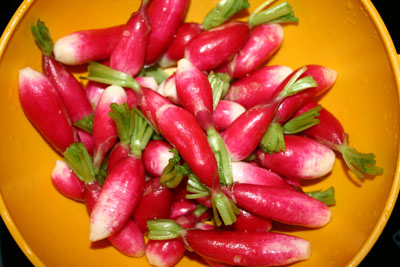

The sun is back and the heat, too. Late morning, we headed over to [rue Mouffetard](http://www.paris.org/Kiosque/dec96/mouffetard.html), where NAM bought these beautiful raspberries, which we then enjoyed in the [Jardin des Plantes](http://en.wikipedia.org/wiki/Jardin_des_Plantes). We headed back to Montmartre to take care of unfinished business at Les Deux Moulins. Actually had a decent lunch there, but also had one of those great "Parisiens are friendly" experiences that no one ever believes. If you recall from [Le Fabuleux destin d'Am�lie Poulain](http://www.imdb.com/title/tt0211915/), there's a phone booth in the back of the cafe. I went there to make a call, opened the cabinet and found some wires hanging out. Looks like it hasn't been a phone for years. Asked our waitress about it and she offered me her mobile phone to use. How nice is that? Told our Parisien friends, who are as convinced as anyone that Parisiens are rude, unfriendly people, about it, and they were astonished! Headed up to [Sacre Coeur](http://www.sacre-coeur-montmartre.com/) once again to enjoy the views in the sunshine.

Spending the weekend in the 14th with the fabuleux R&K. Dinner in was the usual extravaganza. Not going to say how many bottles of Champagne (K's home town) we had--the 2002 Joseph Drouhin Vosne-Romanee was nice too. Have you ever had farmer's radishes with butter and salt?
