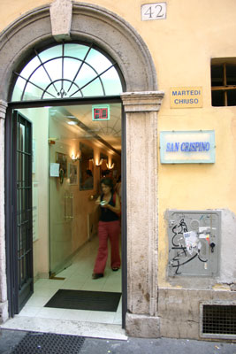
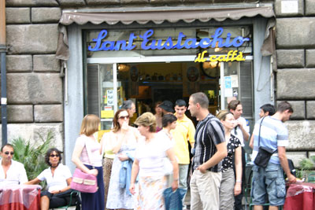

We begin the evening with more superlatives. By all accounts, the best gelato in Rome is to be [found](http://maps.google.com/maps?f=q&hl=en&q=Via+della+Panetteria,+00187+Rome+Roma,+Lazio,+Italy&ie=UTF8&ll=41.901423,12.48475&spn=0.007634,0.021629&om=1) at [il Gelato di San Crispino](https://www.ilgelatodisancrispino.it/). We almost miss the little hole-in-the-wall joint. Expecting to encounter a huge line, having arrived at 18:00, we find the place empty. Told by a sign to take a number, we decide to be anarchists and just walk up and order. My cup is filled with cocoa meringue and the signature “il Gelato di San Crispino.” The latter is a simple, but beautiful blend of honey, [arbutus berry](https://en.wikipedia.org/wiki/Arbutus_unedo) and vanilla ice cream. It’s good. NAM partakes of the pistaccio and crema all’Armagnac. Enjoying the sumptuous ice cream, we slowly amble over to the Trevi and again marvel at its [Bob Guccione](http://en.wikipedia.org/wiki/Bob_Guccione)\-like overthetopitude. Followers of [Audrey Hepburn](http://www.imdb.com/title/tt0046250/) are supposed to enjoy their gelato on the [Spanish Steps](http://en.wikipedia.org/wiki/Spanish_Steps), but we’re too mesmersized to bother finding them at the moment.

From there, it’s on to the best coffee in Rome, which everyone agrees is served by [Sant’ Eustachio il Cafe](http://www.santeustachioilcaffe.it/). We take a seat in the piazza and order two of the Gran Caffe Speciale. That’s some good coffee! What makes it special isn’t so much the coffee itself as the opulent mousse resting on top. It’s luscious and at least a centimetre thick. The sugar and caffeine buzz was just what we needed to get us going for the next step.

[Trastevere](http://en.wikipedia.org/wiki/Trastevere) is, as its name implies, just across the Fiume Tevere. And, we found out, it’s where the cool kids at. Finally! Civilisation, instead of ancient civilisation. We arrived at about 9ish and the narrow streets, full of bars restaurants and cafes, were already filling up with the euro-hipsters. Wandered around a bit before settling on [Paris](http://www.frommers.com/destinations/rome/D33622.html), which features Roman and Jewish food. The latter was represented by the carciofi alla giuda that we shared along with fiori di zuccha. The artichokes were flattened and fried to a crispy diet-damning goodness. The fried zucchini flowers were also rather calorie-laden and even better. Each flower is stuffed with a single anchovy, some mozzarella, battered and fried. Wow! Next moved on to some some grilled langostine-type critters and tuna for NAM. So-so. Not so for the wine, however. The place had a great list featuring many 97 (the vintage of the century?) Tuscans. After some consultation, we settled on the [col D’orcia](http://www.coldorcia.it/) Poggio Al Vento 1997 Brunello di Montalcino Riserva. [Winespectator](http://www.coldorcia.it/) rates this one a 95 and writes _“A fantastic, powerful wine with incredible richness of berry, plum and roasted fruit. Full-bodied, with silky tannins and a long finish. A real treat to taste a beautiful 1997 Brunello now. Drink now. 1,500 cases made. (JS)”_ Nothing really more you can have after a wine like that, so we just strolled along the Tevere for a while, hopped on a bus without paying, and headed back to the [Flora](https://www.marriott.com/en-us/hotels/romdt-rome-marriott-grand-hotel-flora/overview/).

