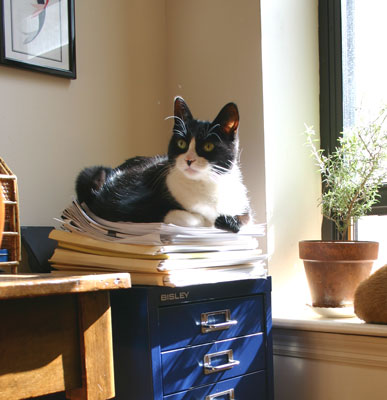

It was a late fall night in 1994. Living at the time in the cheerily dilapidated, spaciously boho upper two floors of a house on Concorde Avenue in Toronto. Not home long when the doorbell rang. Downstairs, the six-year-old girl explained to me that her kitten was trapped on the roof of the house next door. The little furball had escaped the girl's bedroom window, and was strolling along roof-to-roof, down three or four attached houses. The problem came when she got to our place, which wasn't attached. There was a two-foot gap between the house next door and our second-floor balcony. I ran back upstairs, straddled the railing and planted one foot on my side and one foot across the gap. I scooped up the tiny kitten and brought her downstairs to the little girl. This was how I first met Billie.

"Do you want to keep her? We're giving her away." What was this, some kind of scam? NAM was getting home around then and we decided we would try it out the next night. See how she got along with Lulu, the mistress of the house. Well, they got along terribly, or at least Billie behaved rather rudely, arching her back and hissing in the classic Halloween cat pose. Lulu, who had the biggest soul of any person I have ever met, took it in stride. Billie stayed.

She wasn't really named after Billie Holiday, or [Billie Burke](http://www.imdb.com/name/nm0000992/) (Glinda, the Good Witch of the North), or [Billie Whitelaw](http://en.wikipedia.org/wiki/Billie_Whitelaw). And it didn't matter to us that the unenlightened would forever mistake her for a boy because of that handle. Nope, the name fit and we all liked it.

She was always a little naughty. Back in the early days, I think she was always a little under the shadow of her older adopted sister. Acting out got her that extra bit of attention she sometimes needed. Lulu was friendly, calm, brave, graceful. Billie trusted no one beyond me and her mom. Where Lulu could traipse across the top of a Champagne pyramid without disturbing a single bubble, Billie knocked around and was known to break a thing or two. She once broke into a kitchen cupboard and trotted off with a bag of bonito flakes, scattering them about and having a great munchy fest. Got herself trapped in the fridge--twice!

A few years later, during a spell when NAM was the advance guard in New York, and Billie, Lulu and I were hanging back in TO, Billie and I  invented something great: the buddy position. Billie was sticking close to me during this interlude, never leaving my side. I could barely read a book without having her joyfully insert herself somewhere between the pages and my eyes. The buddy position solved this: I would be reading and Billie would snuggle up beside me, resting her head on my shoulder, looking up at me. Later on, she came up with the inverted buddy, whereby she sat on the pillow the other way around. That way she could read along with me. How many happy hours did we spend this way over the years?

All of Billie's emotions were intense. Most of all, when she was happy, her whole being reveled in it. She would flop onto the floor with a thud, stretch her back and roll around. If I came to see her when she was sitting on top of the fridge, she would start to pace back and forth, purring ecstatically. If I stooped over to kiss her while she was sleeping in her little doughnut, she'd start purring and lick my ear. At night, I'd have Lulu sleeping on my pillow and Billie snuggled in around my legs. I could scarcely move; not always the most comfortable arrangement, but I loved it.

When Lulu died suddenly a few years ago, Billie took over the role as head of the household. She was happy to step up. She started running over to greet me when I came home. She kept Zachary in his place. And she loved all the extra time we got to spend together. So did I. When she got sick, I had a month to let her know how much I loved her. But she already knew.

