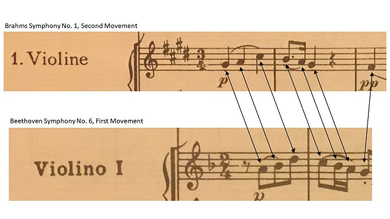

I was listening to the WQXR broadcast of the Vienna Philharmonic at Carnegie Hall last night. It was an all Brahms program: The Academic Festival Overture, The Haydn Variations, and the first symphony. I grabbed my trusty old Dover score and followed along for the performance of the symphony. I was not paying too close attention, but even so, something leaped out at me at the start of the second movement. The opening theme begins with a striking similarity to the first theme of Beethoven's sixth symphony. I grabbed my Beethoven score, and sure enough, the first seven notes of both themes are the same. The Brahms is in E Major, the Beethoven is in F major, so the Brahms is naturally written a semitone lower. Both themes are given to the first violins. The rhythms and tempo are different.

<figure>

<figcaption>

Brahms Symphony No. 1 vs Beethoven Symphony #6.

</figcaption>

</figure>

I'm wondering if this was a purposeful quote, or just a coincidence. Also makes me wonder if there are any other Easter eggs in "Beethoven's 10th?"
