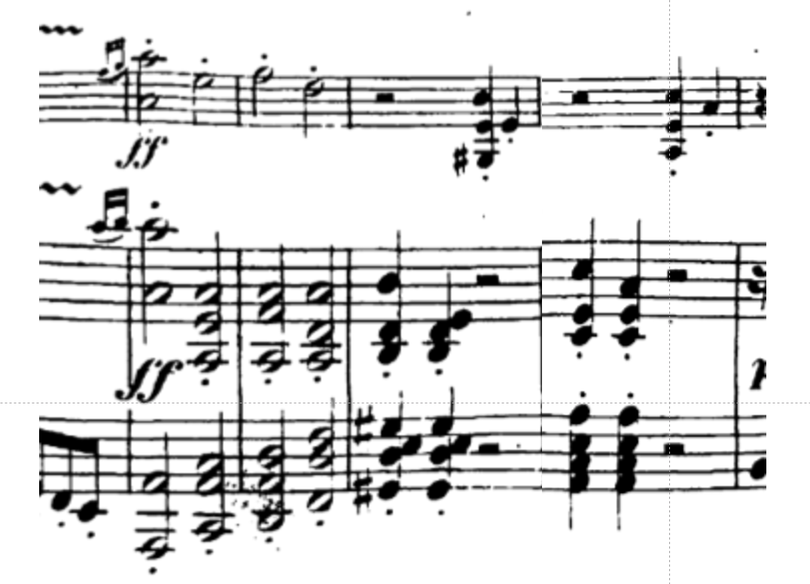

I'm only 21 pieces in so far, so I will need to pick up the pace to make it through all 194 pieces with opus number this year. Right now, I'm listening to the Violin Sonata No. 1 in D Major, Op. 12 number 1, and just came across my first "favorite moment" in these early pieces. It's a cadential figure that happens in the first movement, at the end of the second theme.

<figure>

<figcaption>

Beethoven Violin Sonata No. 1 in D Major, Op. 12 number 1

</figcaption>

</figure>

From what I can recall, I first heard this piece in a performance in [von Kuster Hall](https://music.uwo.ca/about/facilities/von-kuster-hall.html) at [UWO](https://music.uwo.ca/), around 1987 or 1988. This moment is striking, and you can hear why it would appeal to someone who has played rock guitar. Even better than a power chord!
