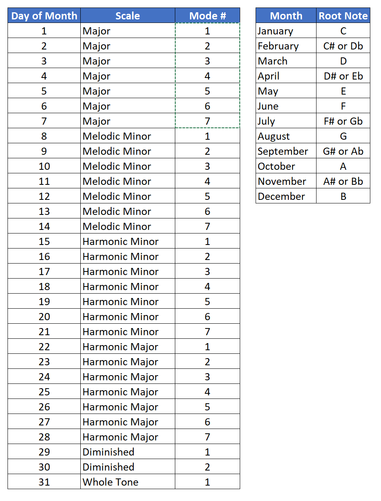

I just got back from two weeks at the [Jamey Aebersold Summer Jazz Workshop](http://workshops.jazzbooks.com/about-us/summer-jazz-workshops/). It was amazing, as always, and especially important since this is the final session before Jamey retires after running the "camps" for over fifty years. I sat in on [Pat Harbison](http://info.music.indiana.edu/faculty/current/harbison-patrick.shtml)'s advanced music theory class, and I got some great ideas out of that.

One idea in particular got me thinking about digging deeper into the sound of specific modes. Pat mentioned something along the lines of "twenty-eight modes ought to be enough." Since there are about twenty-eight days in a month, and twelve months, I saw how you could practice a different mode on a different root note every day of the year. Take the month as your root, and the day as your mode number. The base scales I chose were Major, Melodic Minor, Harmonic Minor, Harmonic Major. For the extra days in the month, up to three in a month with thirty-one days, I added Diminished (mode 1), Diminished (mode 2), and Whole Tone. Today is July 17, so that means my mode of the day is the second mode of Harmonic Minor, with a root note of F# or Gb. The whole scheme is summarized in the charts below.

<figure>

<figcaption>

Figure 1. How to practice a different mode on every day of the year.

</figcaption>

</figure>

### **Key Takeaways**

If you are stuck in a rut practicing modes, try this method. You don't need to keep it up for a year, but if you try it for a while, you will learn that some of the modes you never practice are really beautiful.
