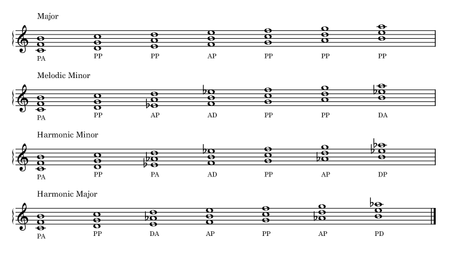
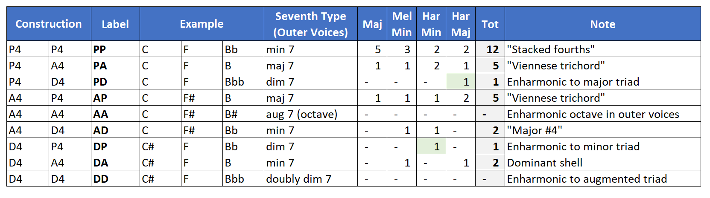

Today we continue the discussion on quartal harmony with trichords. Yesterday's topic on quartal dyads was a bit of a warm-up. Things are getting more interesting now. There are three varieties of fourth: perfect, augmented, and diminished, or using our labels, P, A, and D. In order to construct a trichord, we need two intervals. That gives us a total of nine different types of quartal trichord. These are shown in the Fig. 2 chart below. When looking at the harmonizations of our four scale types, Major, Melodic Minor, Harmonic Minor, and Harmonic Major, we can make some observations about how often the trichords appear.

Two of the trichords, AA and DD, do not appear in any of the harmonizations. In AA, the outer voices form an augmented seventh, which is enharmonically equivalent to an octave. In DD, the trichord is enharmonically equivalent to an augmented triad.

We saw yesterday that P was the most common dyad, and see now that PP is the most common trichord. It occurs five times in the Major harmonization, three times in the Melodic Minor, and two times in each of the Harmonic Minor and Harmonic Major. So then, just like the P dyad, the PP trichord is the most harmonically ambiguous of the quartal trichords.

The next most common trichords are two of my favorites. They combine an outer major seventh, and inner perfect and augmented fourths, or PA and AP. I love both of these sonorities and used them often in my early composing. (Berg and Webern loved them too, so much so that they are sometimes referred to as the [Viennese trichord](https://en.wikipedia.org/wiki/Viennese_trichord).)

Two of the trichords occur in only one harmonization. PD occurs in only the Harmonic Major harmonization, and DP occurs in only the Harmonic Minor. As a result, these two trichords are the most harmonically specific.

I find it interesting to look at the similarities and differences among the four harmonizations. One thing that leaps out is that all four harmonizations share the same trichords on modes 1, 2, and 5, or on the tonic, supertonic, and dominant. So, for example, a riff on the tonic and supertonic trichords would be completely harmonically ambiguous; it would fit with any one of the four scales. Somewhat surprisingly, the dominant is the same for all four.

Not surprising is where the most variation occurs between the harmonizations: on the mediant and leading tone. Both of these degrees (or modes) contain both the third and the sixth, which is where all of the variation between these four scales takes place. Contrast this with the subdominant and submediant. The subdominant trichords contain the third, so the two with the lowered third are the same, and the two with the natural third are the same. For the submediant, the two with the lowered sixth are the same, and the two with the natural sixth are the same.

<figure>

<figcaption>

Figure 1. Major, Melodic Minor, Harmonic Minor, Harmonic Major scales harmonized with Quartal Trichords.

</figcaption>

</figure>

<figure>

<figcaption>

Firgure 2. How many times does each trichord appear in the four scale harmonizations?

</figcaption>

</figure>

### **Key Takeaways**

From a practical standpoint, here are a few things to keep in mind using quartal tichords for comping or soloing:

- The texture of a trichord is very useful for comping, especially on the guitar
- Any quartal trichord material built on I, II, and V will work for each of the four different scales
- The quartal trichord material on II, VI, and VII is where all the harmonic differences are

That's it for today's installment. In later posts, I will look at quartal tetrachords, as well as usage of inversions for the trichords we looked at today.
