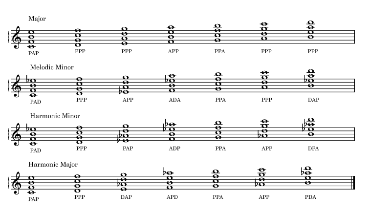
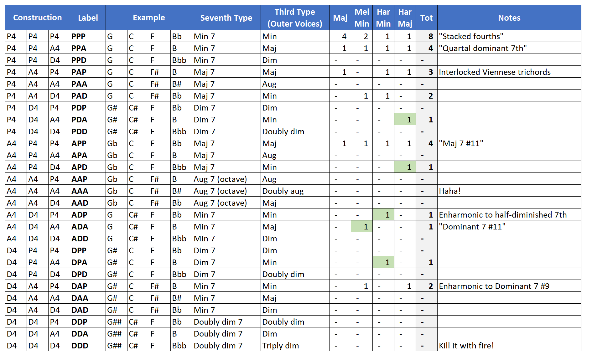

In today's post we will continue our series on quartal harmony with a quick look at quartal tetrachords. When we began with dyads, we saw there are three quartal dyad types: P, A, and D. With quartal trichords, there are nine types (3 \* 3). With quartal tetrachords, we now have twenty-seven types (3 \* 3 \* 3). These are summarized in Figure 2. Of the twenty-seven, only eleven occur in our four scale harmonizations.

As before, the most common tetrachord type is based on stacked perfect fourths, PPP. This type occurs nine times in total across the harmonizations, making it once again the most harmonically ambiguous chord type. PPP occurs four times in the Major harmonization, twice in the Melodic Minor, and once in each of the other harmonizations.

After PPP, the next most common tetrachords are PPA and APP, both of which occur four times, once in each of the harmonizations. Both of these are very useful voicings. APP can easily serve as a Maj7#11 and PPA can serve as a dominant, as we shall see next.

When looking across the four harmonizations, we see an interesting detail on the both the supertonic and dominant degrees: they each share the same tetrachord across the harmonizations. In all cases, the supertonic is a PPP, and the dominant is a PPA. In other words, the II-V quartal tetrachords are the same for Major, Melodic Minor, Harmonic Minor, and Harmonic Major.

We mentioned the [Viennese trichord](https://en.wikipedia.org/wiki/Viennese_trichord) in our last post. Any tetrachord that contains either PA or AP is a superset of the Viennese trichord. Our next most common tetrachord is PAP, which occurs three times in the harmonizations. Once can see PAP as an interlocked PA and AP, or an interlocked Viennese trichord. A Viennese tetrachord perhaps? This voicing also functions well as Maj7 11 chord.

<figure>

<figcaption>

Figure 1. Major, Melodic Minor, Harmonic Minor, Harmonic Major scales harmonized with Quartal Tetrachords.

</figcaption>

</figure>

<figure>

<figcaption>

Firgure 2. How many times does each tetrachord appear in the four scale harmonizations?

</figcaption>

</figure>

### **Key Takeaways**

From a practical standpoint, here are a few things to keep in mind using quartal tetrachords for comping or soloing:

- The texture of a quartal tetrachord is getting fairly thick and might be a practical upper limit for comping, especially on guitar
- The quartal tetrachord material for II and V is the same for each of the four scales, so work on those quartal II-Vs and you will get a lot out of them!
