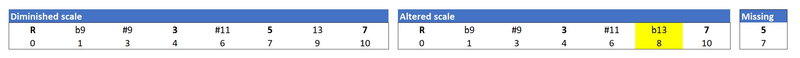
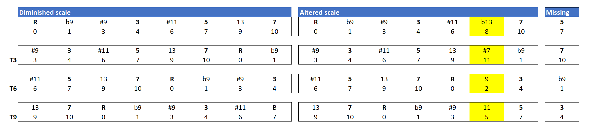
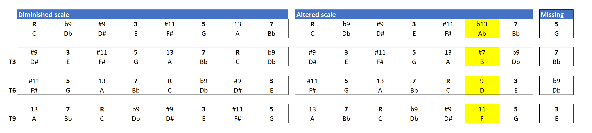

A guitarist on the forum of [Dave Stryker's class at Artistworks](https://artistworks.com/jazz-guitar-lessons-dave-stryker) recently asked an interesting question that really piqued my interest. The question is, can you transpose the altered scale in minor thirds, the same way you can transpose the diminished scale? I’ve been thinking for a while about how the diminished, altered, and whole-tone scales are related, so let’s treat this as a prelude to that topic.

The altered scale differs from the diminished scale in two ways. First, the altered scale is a seven-note scale and the diminished is an eight-note scale, so the altered will always have one note missing compared to the diminished. Second, the altered scale has one note different, it has a b13 (or #5), where the diminished scale has a natural 13. So, to sum up, one note missing, one note different. You can see this in the first figure.

<figure>

<figcaption>

Figure 1. Diminished Scale vs. Altered Scale

</figcaption>

</figure>

(Note: in the figure above, the Arabic numbers in the second row are called pitch classes. If you are not familiar with them, for now, you can assume 0=C, 1=Db, 2=D, and so on. It is much easier to think about transpositions, inversions, and symmetry when you consider pitches this way.)

Now lets see what happens as we start transposing at minor 3rds. For the altered scale, as we already know, every time we transpose a minor 3rd, we end up with the same collection of pitch classes, so essentially the same chord and the same extensions. Check out what happens with the altered scale. For each transposition, we have one note missing (the last column) and one note different (highlighted in yellow).

<figure>

<figcaption>

Figure 2. Diminished Scale vs. Altered Scale m3 Transpositions.

</figcaption>

</figure>

Of all the transpositions of the altered scale, the one at the tritone makes the most sense; it’s easy to see it as a dominant 13 #11 chord. The other two minor 3rd transpositions are maybe a little trickier, since one lacks the major 3 and the other lacks the seventh. But I would wager that one could make convincing use of all of the transpositions, and maybe sound a little bit outside.

Here’s the same figure with pitch notation rather than pitch-class notation.

<figure>

<figcaption>

Figure 2. Diminished Scale vs. Altered Scale m3 Transpositions (with traditional pitch notation).

</figcaption>

</figure>

One more thing I’ll point out, and this is admittedly getting into theory-geek territory. Since the diminished scale is an eight-note scale, it has four notes missing with respect to the twelve-note chromatic scale. In the language pitch-class set theory, those four notes together form the complement of the diminished scale; diminished plus complement equals chromatic. You will notice that the highlighted different notes in the altered scale, taken together, for the complement of the diminished scale. I’m not sure if that is a useful observation in jazz, but if Anton Webern played jazz, he would probably have figured out how to use it.
