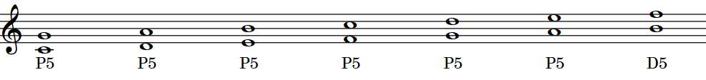
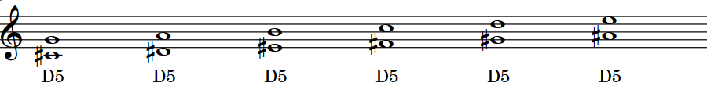
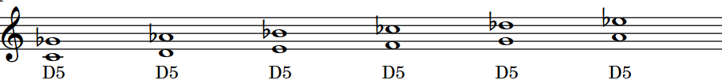
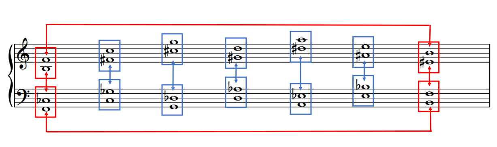

This post kicks off a miniseries on tritones. I’ll use the terms tritone and diminished 5th somewhat interchangeably. This post covers some basics, the next one will explore an idea about key signatures, then I’ll look at diminished 7th chords. 

<figure>

<figcaption>

The seven natural 5ths

</figcaption>

</figure>

Let’s start by considering the seven natural notes. If we place a natural note a 5th  above each of the seven natural notes, we see we see that we now have six perfect 5ths and one diminished 5th.  

- FF1 There is only one diminished 5th made of natural notes: B-F 
- FF2 There are six perfect 5ths made of natural notes 
- FF3 Any 5th made of natural notes, other than B-F, is perfect 

OK, let’s look at each of these natural perfect 5ths. There are two ways we can turn a perfect 5th into a diminished 5th. We can raise the bottom note with a sharp. Or we can lower the top note with a flat. 

<figure>

<figcaption>

The six "sharp" tritones

</figcaption>

</figure>

<figure>

<figcaption>

The six "flat" tritones

</figcaption>

</figure>

- FF4 Other than B-F, any 5th with a sharp on the bottom and a natural on the top is diminished; there are six of these 
- FF5 Other than B-F, any 5th with a natural on the bottom and a flat on the top is diminished; there are six of these 

So, there are six tritones with one sharp and one natural, and six tritones with one natural and one flat. But six intervals adds up to twelve notes, so the six “sharp” tritones add up to the entire chromatic scale. And then, so must the six “flat” tritones also add up to the entire chromatic scale.  

- FF6 The six tritones with a sharp on the bottom and a natural on the top make up the entire chromatic scale 
- FF7 The six tritones with a natural on the bottom and a flat on the top make up the entire chromatic scale 
- FF8 For every tritone with a sharp on the bottom and a natural on the top, there is an enharmonically-equivalent tritone with a natural on the bottom and a flat on the top 

Hey, if the tritones with only one sharp cover the chromatic scale, and so do the ones with one flat, then what about B-F? Is that an extra tritone, since it has no sharps or flats? Oh good question, but B-F is covered enharmonically in both cases: E#-B, and F-Cb. 

- FF9 The tritone with no sharps or flats, B-F, has an enharmonic equivalent with one sharp, and another equivalent with one flat 

<figure>

<figcaption>

All six _enharmonically-related tritones_

</figcaption>

</figure>

The diagram above summarizes all six enharmonically-related tritones that can be spelled with either two naturals, a natural and a sharp, or a natural and a flat. (There are actually two more that can be made with two sharps or two flats, but they are also enharmonically equivalent. I'll cover those in the next post.) Oh, let's go ahead and formalize this with its own fun fact!

- FF10 There are only six tritones and their enharmonic equivalents

Actually, this makes sense from another perspective. On the piano, B-F is made of white notes only. We said earlier that there are six tritones with one natural and one sharp. But wait, there are only five black keys. So one of those sharps has to be a white key. Same goes for tritones with flats. 

- FF11 Every tritone consists of one white key and one black key, except for B-F and its two enharmonic equivalents 

So, B-F is kind of weird, right? What’s also interesting is that to turn B-F into a perfect 5th, you have to do the opposite operation: raise the top note with a sharp, or lower the bottom note with a flat. 

- FF12 To turn a diminished 5th into a Perfect 5th, you can either raise the top note with a sharp, or lower the bottom note with a flat 

OK, so this is mildly interesting (or wildly, in which case, you may have a career as a music theorist ahead of you!), but is there any practical application? Why, yes! This should help with automatic recognition of intervals. Remember, other than B-F, two naturals always means perfect; sharp on bottom and natural on top always means diminished; natural on bottom, flat on top always means diminished. This should also help with instant recognition of 5ths with double flats and double sharps.  

That’s enough for today. Next time, we are going to talk about key signatures.
