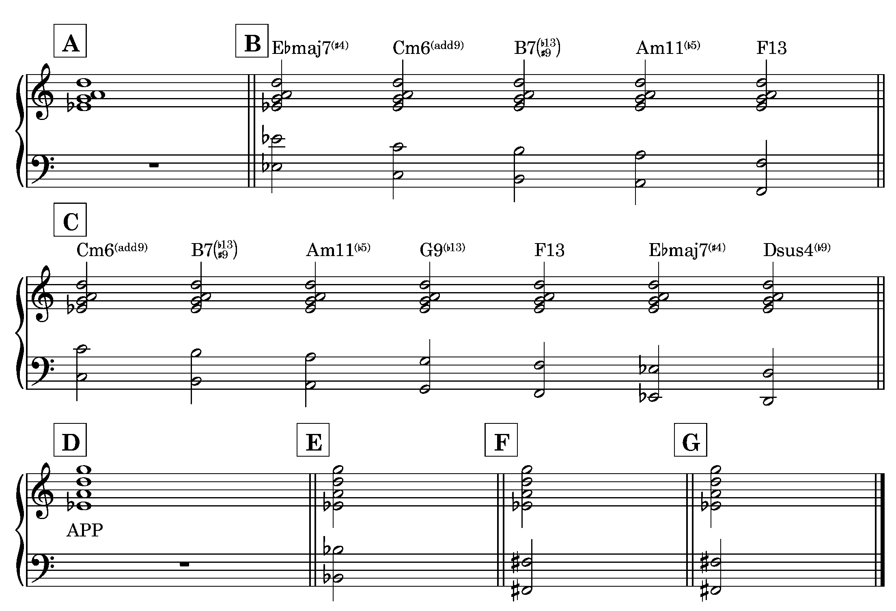

During our weekly jam session this week, my friend Tony and I got into a discussion about a harmonic topic we’ve both been looking at. It’s an intervallic shape that’s pretty useful harmonically and melodically, and has a good ‘modern jazz’ feel to it. You can see the shape in example \[A\] below. You might call this a “minor 6/9” shape, since it has the 3rd, 5th, 6th, and 9th of a minor chord.

But what makes this shape so useful is its ability to outline different chords. Example \[B\] lists five of these. If we think of the Eb as the root of a chord, we have an EbMaj7#4. If we think of it as a minor 3rd, we have a Cm6/9. If we think of the Eb as a D# serving as a major 3rd, we have a B7#9b13, which is an ‘altered dominant’ sound. If we think of the Eb as the b5th of a chord, we have an Am11b5. And if we think of the Eb as the 7th of a chord, we have an F13 chord.  

As I’ve been exploring this sound, it dawned on me that since the shape is a subset of the melodic minor, then it can be harmonized with all of the notes of the harmonic minor, expanding the number of chords from five to seven. These are all listed in example \[C\].

The shape also lends itself to quartal voicing, which is great since quartal harmony is another key component of modern jazz, and, as a guitarist, quartal voicings fit on the neck beautifully. Looking at example \[D\], we can see that the shape contains the “[Viennese trichord](https://en.wikipedia.org/wiki/Viennese_trichord)” with a perfect 4th on top. If we label the chord according to its constituent 4ths, we can call it an APP.

I did a post on [quartal tetrachord harmonizations](https://www.chesterjankowski.com/quartal-harmony-tetrachords/) a couple of years ago, and if we refer to that, we see that the quartal tetrachord APP appears (get it, APPears?) in not only the melodic minor, but also in the major, the harmonic minor, and the harmonic major. That means we can also harmonize the shape with all the notes of each of those scales.

If we look at the major scale, we see that the APP is on the 4th degree of the scale. Keeping Eb as the bass note, that would mean our new scale is Bb major. Bb major has only one note different from C melodic minor: the Bb itself. That means the chord with Bb as the root is a new one, the other six notes are the same as chords we have already discovered. This new chord is shown in example \[E\]. I didn’t label this chord, but you could think of it as EbMaj7#4/Bb or Bb13sus. We are now up to eight chords.

Looking at harmonic minor and harmonic major, the APP appears on the 6th degree of the scale. Eliminating chords we have already discovered, this gives us one new chord, with an F# as the root. I will leave it to you to label that one.

So now we have a total of nine discrete chords across these four scales. A good next step would be to see how we could use parallelisms across these chords in different progressions, but I will leave that topic for another day.
