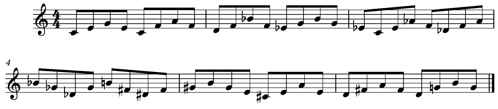
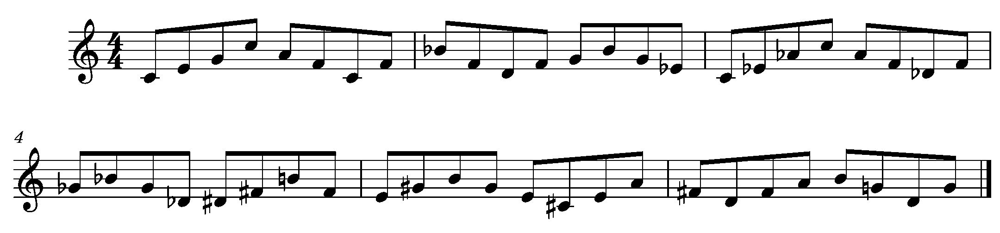
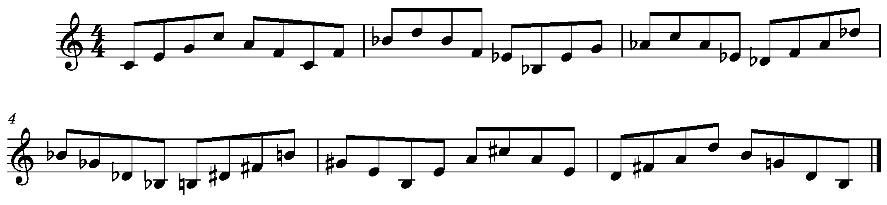
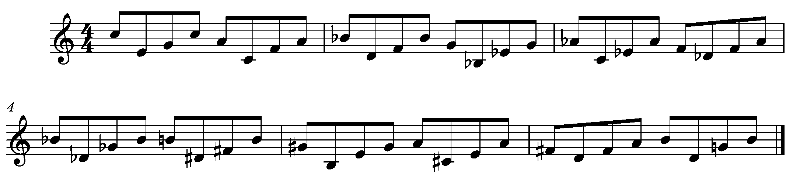

My teacher, Mark Sherman, gave me a simple assignment at our last lesson: practice cycling through 12 keys using only major triads, mostly as 4-note chords, all while restricting yourself to a narrow range. I think this one is worth dedicating some serious time.  

OK, so let’s think about this algorithmically. The basic rules are simple: 

- The only notes allowed are from the major triad 
- Play 4 notes from each triad
- Keep going in the same direction until you hit an upper or lower boundary, at which point, change direction 
- No repeated notes 
- After 4 notes, cycle to the next triad in the descending cycle of 5ths 

First question: what is the most narrow range into which you can fit the entire cycle? Answer: ok, maybe a bit of a trick question? Obviously, you need all 12 notes, so the smallest range would be 12 semitones, or a major 7th. Another obvious observation (obvservation?): there are no octaves anywhere, so every triad will have one note played twice in the 4-note grouping.  

<figure>

<figcaption>

Ex. 1 Triads Within a Major 7th

</figcaption>

</figure>

Well, that’s a good exercise, but it is rather limited! What if we expand the range by one semitone? Now we have a full octave, C to C. That one note actually opens thing up quite a bit! Now we have an octave on the root of C major, on the 3rd of Ab major, and on the 5th of F major. Cool!  

<figure>

<figcaption>

Ex. 2 Triads Within an Octave

</figcaption>

</figure>

What if we wanted to find the minimum range that would allow each of the 12 triads to have at least one octave? Well, on the one hand, every note is part of 3 different triads, it’s either the root, the 3rd, or the 5th. So every note we add will add 3 more triads, right? Well, not quite, because notes that are a 3rd apart will have a triad in common. 

So let’s see how this plays out. Let’s add a B below middle C. That gives us three more triads: B major, G major, and E major. That’s a total of six triads, we are half-way there! Let’s keep going down, adding Bb gives us Bb major, Gb major, and Eb major. Wow, 9 out of 12 covered! 

This time, let’s add a higher note; we’ll add C#. That gives us C# major, A major, F# major. Oops! Not quite 3 more, because F# and Gb are the same. It makes sense, because we said that notes a 3rd apart will share one triad, and Bb and C# (or Db) are a 3rd apart. 

OK, we are at 11 out of 12. Let’s add one more higher note, D. That gives us D major, Bb major (which we already had) and G major (which we already had). Woohoo, 12 out of 12. Why did D add only one new triad? Well, it is a 3rd away from Bb, so shares a triad there, and it is a 3rd away from B, so shares a triad there too!  

Now we have all 12 triads with at least one octave. By the way, you know those triads we said we ‘already had?’ F#/Gb major, Bb major, and G major? Well, those ones have two different notes with an octave.   

<figure>

<figcaption>

Ex. 3 Triads Within a Major 10th

</figcaption>

</figure>

So, to summarize, the smallest interval that will allow you to cycle all 12 triads with at least one octave per triad is a major 10th. 

OK, this is all good so far, but the motion rule is a little bit dull. Let’s try throwing in what Barry Harris calls pivoting. Pivoting breaks up the motion of an arpeggio, or broken chord, by adding an octave displacement, either up or down, and then continuing. In this example, we will play a note, pivot down to the next chord note, and continue upward for 3 notes. We’ll then chose the closest note in the next chord and repeat the process. This way all of the 4-note groups will have a similar countour.  

<figure>

<figcaption>

Ex. 4 Triads Pivoting Within a Major 10th

</figcaption>

</figure>

That’s all for now!
