# {{ title }}

## uniform random

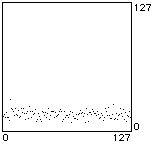

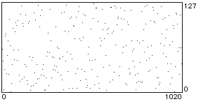

[uniran.mid](http://cyberkrunk.com/music/stochyard/orbit/uniran.mid)

histogram: 2048 values; note graph: 1024 values; MIDI file: 256 values

This is uniform distribution which random number generators usually default to. Typically, a value from 0 to 32767 is generated, then divided by 32768 to result in a number in the range \[0...1). Eventually, the histogram should flatten out to a straighter line.

Based on Litter implementation (which is based on Gary Lee Nelson's Rand oblect).

## brownian noise

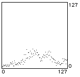

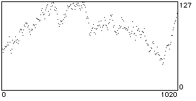

[brown.mid](http://cyberkrunk.com/music/stochyard/orbit/brown.mid)

histogram: 2048 values; note graph: 1024 values; MIDI file: 256 values

scatter factor 0.2

A random walk (or "staggering drunk") in which successive values are a certain random step-size apart. A sufficiently high step-size (or scatter foctor) will result in the uniform distribution above. A step-size of 0 will result in the same value being repeated. Any step-size greater than 0 should eventually lead to a flat histogram.

Based on Litter implementation. Also implimented in MAX's built-in drunk object.

## Gauss-Laplace distribution

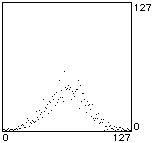

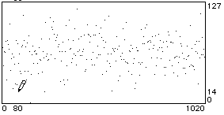

[gauss.mid](http://cyberkrunk.com/music/stochyard/orbit/gauss.mid)

histogram: 2048 values; note graph: 1024 values; MIDI file: 256 values

mu: 64; sigma: 20

Also known as the normal distribution, or bell-curve. This implementation has two variables, mu and sigma. Sigma is a scaling factor and mu is an offset.

Based on Litter implementation.

## arc sine distribution

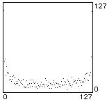

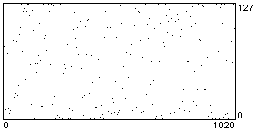

[asinran.mid](http://cyberkrunk.com/music/stochyard/orbit/asinran.mid)

histogram: 2048 values; note graph: 1024 values; MIDI file: 256 values

A useful function, since the U-shaped histogram favours the upper and lower limits.

Based on Litter implementation.

## beta distribution

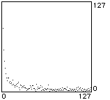

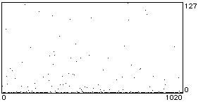

[betaran.mid](http://cyberkrunk.com/music/stochyard/orbit/betaran.mid)

histogram: 2048 values; note graph: 1024 values; MIDI file: 256 values

alpha: 0.1; beta: 0.9

Takes two variables, alpha and beta. When alpha and beta are both 0.5, the arc sine distribution results. A higher beta value 'tilts' the U-shape of the histogram to the left (and vice-versa).

Based on Litter implementation.

## Cauchy distribution

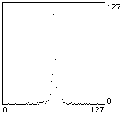

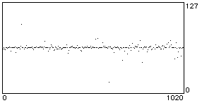

[cauchy1.mid](http://cyberkrunk.com/music/stochyard/orbit/cauchy1.mid)

histogram: 1024 values; note graph: 1024 values; MIDI file: 256 values

tau: 1; iopt: 0; + 64

The histogram is somewhat similay to the normal distribution, but the two extremes trail off much more gradually. In this run, the centre value for the histogram went off the scale at around the 270th value. This implementation takes two values: tau controls the spread at the centre, higher values giving more spread. iopt is either 0 or 1: a value of 0 gives the complete symmetrical histogram, a value of 1 gives only the positive half. Here 64 was added as an offset.

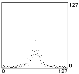

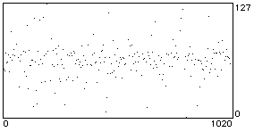

[cauchy2.mid](http://cyberkrunk.com/music/stochyard/orbit/cauchy2.mid)

histogram: 1024 values; note graph: 1024 values; MIDI file: 256 values

tau: 10; iopt: 0; + 64

The value of 10 for tau spreads out the shape, but in this instance generated many values out of the 0-127 MIDI range.

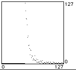

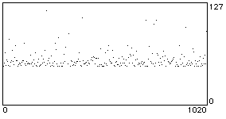

[cauchy3.mid](http://cyberkrunk.com/music/stochyard/orbit/cauchy3.mid)

histogram: 1024 values; note graph: 1024 values; MIDI file: 256 values

tau: 5; iopt: 1; + 48

Here the value of 1 for iopt generates only the upper half of the histogram.

Based on Litter implementation.

## voss (1/f noise)

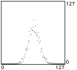

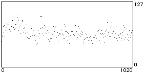

[voss.mid](http://cyberkrunk.com/music/stochyard/orbit/voss.mid)

histogram: 2048 values; note graph: 1024 values; MIDI file: 256 values

Based on Litter implementation.
